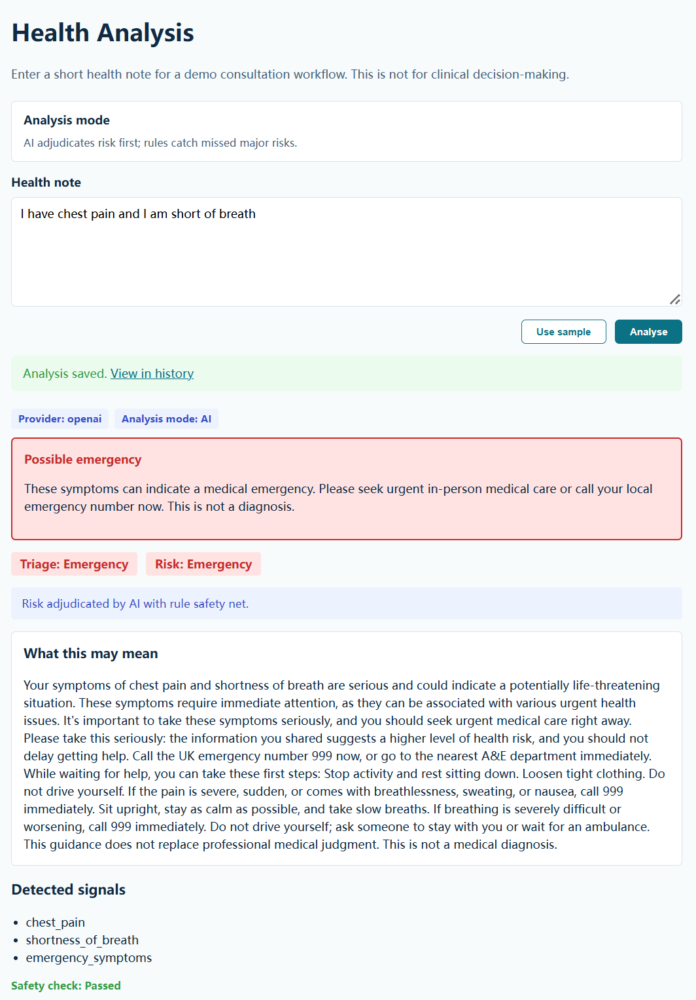
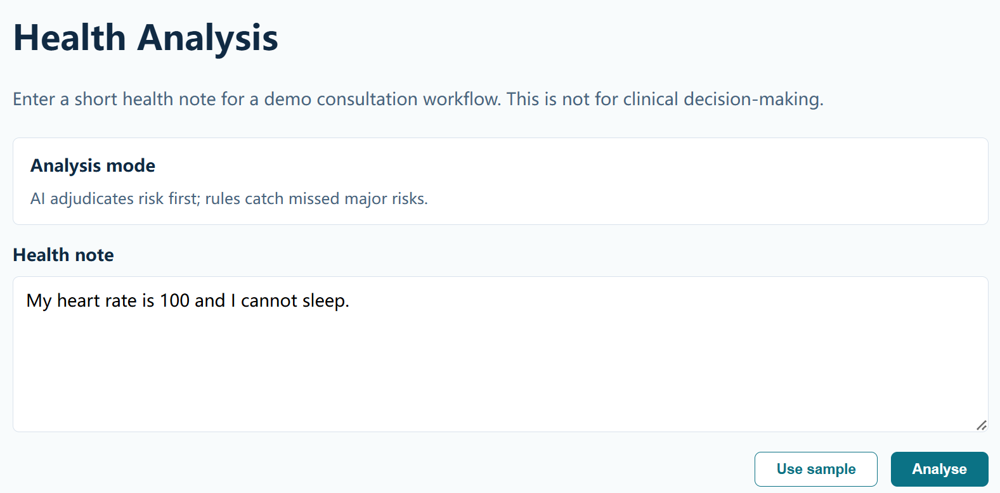
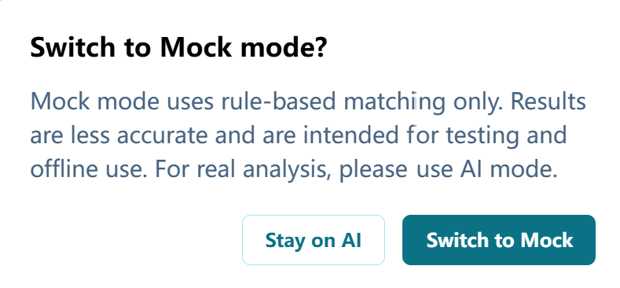
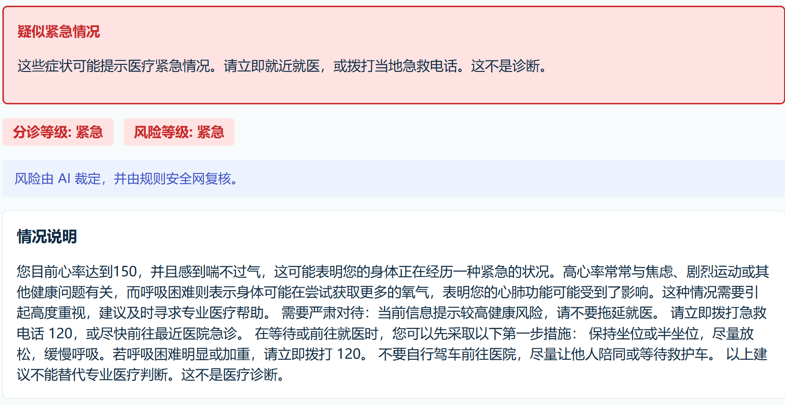
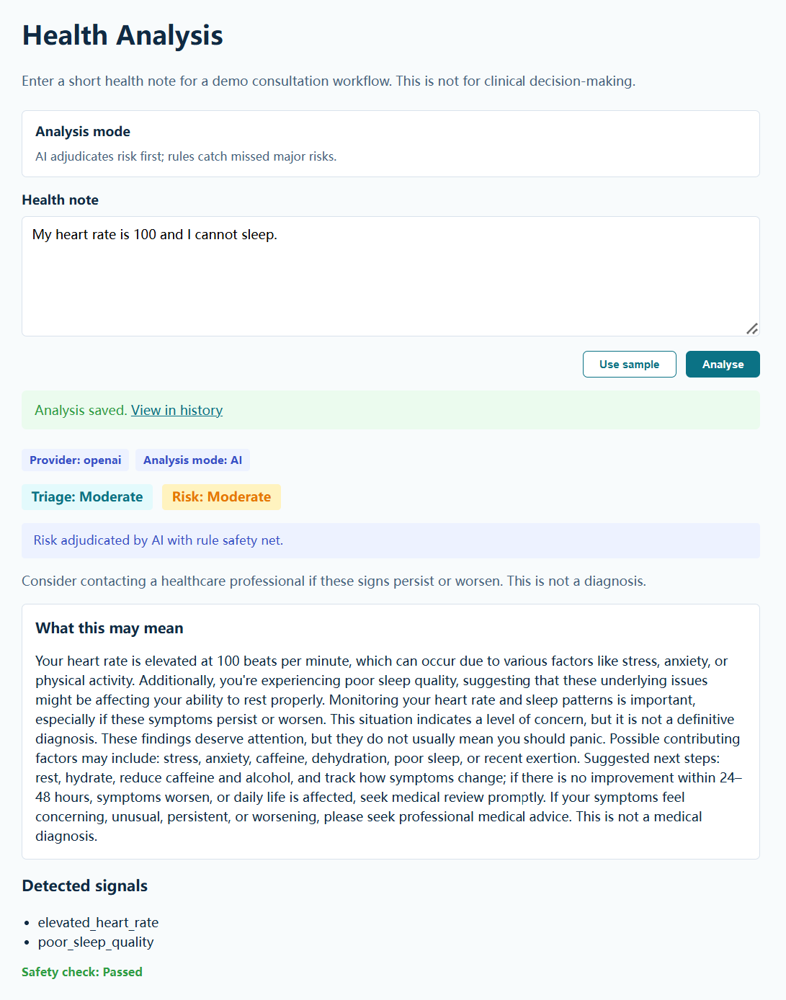
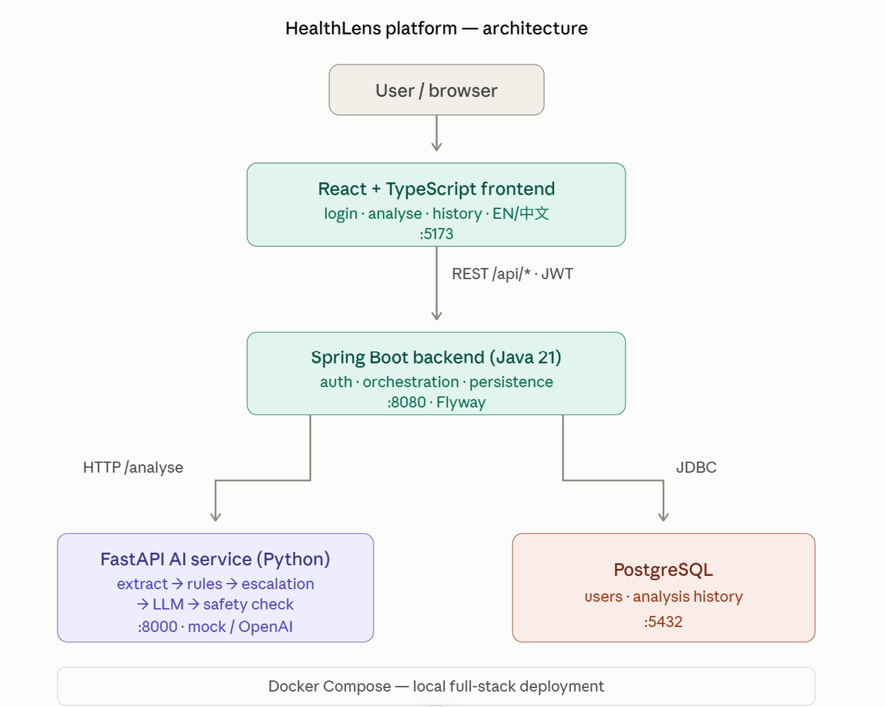
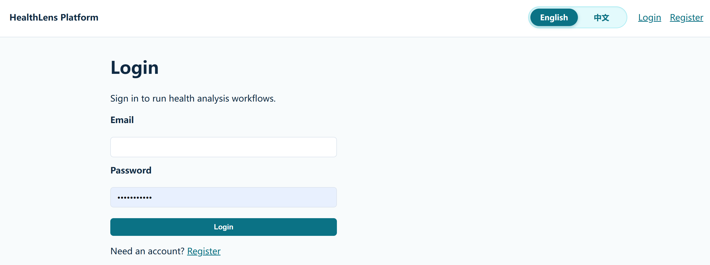
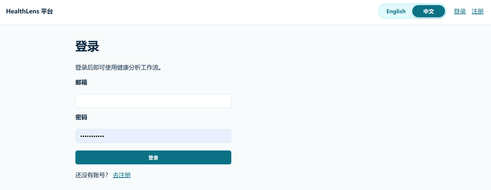
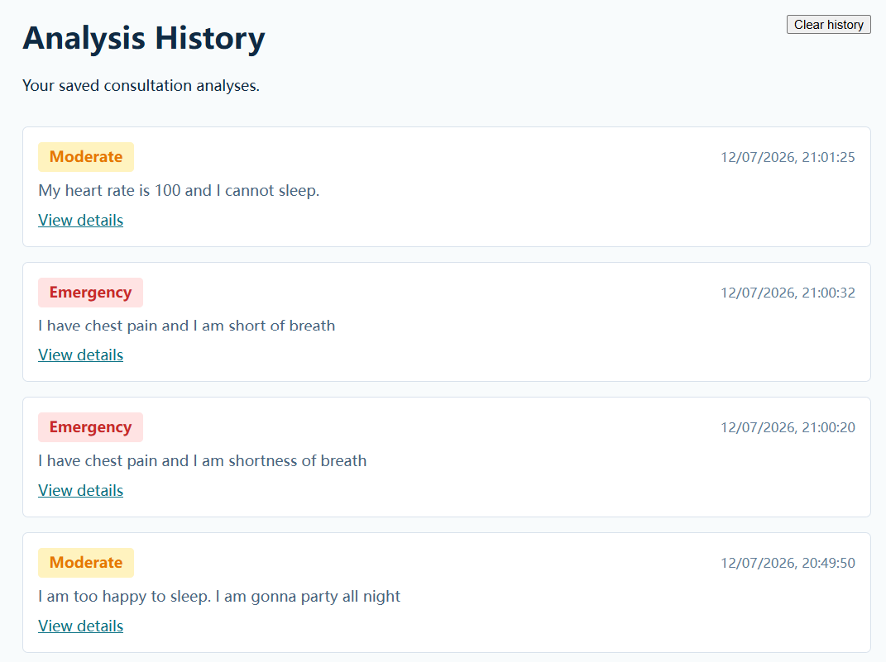
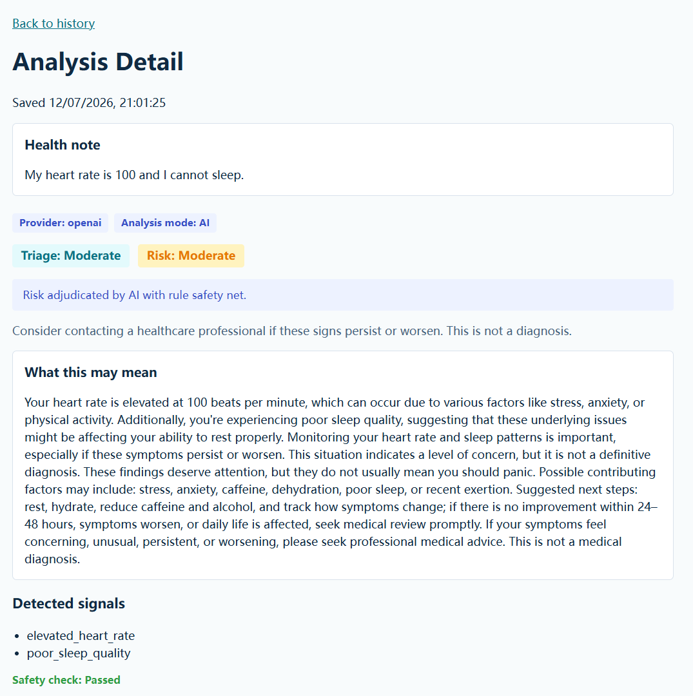

# HealthLens Platform —— 更安全的 AI 健康咨询平台

<p align="right">
  <a href="./README.md">English</a> | <a href="./README_CN.md">中文</a>
</p>

**HealthLens Platform** 是一个完整的医疗 AI 产品 Demo，而不只是单一 API。它将
**React** 前端、**Spring Boot** 后端、**FastAPI** AI 管线与 **PostgreSQL**
持久化整合为一套可部署的平台，用于结构化、安全的健康咨询工作流。

> **免责声明：** 本项目是产品设计与工程原型，**不是医疗器械，不构成医疗建议**，
> 也**不得用于**诊断、治疗或临床决策。

---

## 项目概述

当用户输入「胸口发闷、喘不上气」时，这类咨询天然不确定、被焦虑驱动、且关乎安全。
通用聊天机器人也许回答得很流畅——但有时也很危险。

HealthLens 让每条健康描述流经一条**设计好的咨询工作流**：信号提取 → 风险裁定（规则
和/或 AI）→ 规则安全网 → 紧急升级 → 面向健康状况的说明 → 安全校验。**Mock 模式**下
由规则单独裁定风险；**AI 模式**下 AI 先裁定，规则只能**抬高**风险、不能降低。

本仓库是 **平台版**：用户账号、JWT 保护接口、分析历史（含清空）、中英文界面、**Mock /
AI** 分析模式，以及 Docker Compose 一键本地全栈运行。

**产品与设计文档**（AI 管线设计 rationale）

| 文档 | 内容 |
| --- | --- |
| [`ai-service/docs/AI_HEALTH_PRD.md`](./ai-service/docs/AI_HEALTH_PRD.md) | 产品需求文档 |
| [`ai-service/docs/CONSULTATION_WORKFLOW.md`](./ai-service/docs/CONSULTATION_WORKFLOW.md) | 咨询工作流设计 |
| [`ai-service/docs/TRIAGE_POLICY.md`](./ai-service/docs/TRIAGE_POLICY.md) | 四级分诊框架 |
| [`ai-service/docs/MEDICAL_AI_SAFETY_POLICY.md`](./ai-service/docs/MEDICAL_AI_SAFETY_POLICY.md) | 五层安全策略 |
| [`ai-service/docs/HEALTHCARE_EVALUATION.md`](./ai-service/docs/HEALTHCARE_EVALUATION.md) | 医疗安全与质量评估套件 |

**平台工程文档**

| 文档 | 内容 |
| --- | --- |
| [`docs/architecture.md`](./docs/architecture.md) | 多服务架构 |
| [`docs/api-contracts.md`](./docs/api-contracts.md) | REST API 契约 |
| [`docs/development.md`](./docs/development.md) | 本地开发指南 |
| [`docs/deployment.md`](./docs/deployment.md) | 生产环境 JWT 与部署说明 |

---

## 核心功能

| 功能 | 说明 |
| --- | --- |
| **Mock / OpenAI / DeepSeek** | 顶部滑块选择：**Mock**（规则+模板）、**OpenAI** 或 **DeepSeek**；规则安全网始终生效 |
| **结构化 AI 管线** | 提取 → 风险裁定 → 升级 → 说明 → 安全校验 |
| **紧急覆盖** | 红旗症状（胸痛、中风征象等）提升分诊，即使体征风险仍为低 |
| **健康状况说明** | 按风险分级：低风险安慰与日常建议；中风险可能原因与应对；高/紧急含急救电话与第一步措施 |
| **JWT 认证** | 注册、登录、受保护的分析接口 |
| **分析历史** | 持久化、浏览，并支持**清空全部**历史记录 |
| **双语界面** | 顶部 **English / 中文** 与 **Mock / OpenAI / DeepSeek** 胶囊滑块；API `language` 与界面同步 |
| **双语提取** | 中英文心率/血压（如 `heart rate 200` 与 `心率200`） |
| **Docker Compose** | 一条命令启动全栈；前端源码挂载便于开发热更新 |


---

## 平台能评估哪些方面

> **不是诊断。** 系统对自由文本健康描述做**风险分诊与安全提示**，不能替代临床诊断。

| 类别 | 输入示例 | 用途 |
| --- | --- | --- |
| **心率** | `heart rate 100`、`心率200` | 阈值标志（>100 偏高，>120 很高） |
| **血压** | `BP 150/95`、`血压200` | 升高 / 极高收缩压或舒张压 |
| **情绪** | anxious、焦虑、压力大、心情低落 | 焦虑/压力或情绪低落标志 |
| **睡眠** | can't sleep、睡不着、失眠 | 睡眠质量差标志 |
| **紧急症状** | 胸痛、呼吸困难、中风征象、大出血等 | 关键词升级 → **紧急**分诊（无需数字体征） |
| **自由症状描述** | 「胸口发闷」「浑身不舒服」 | **AI 模式**下 OpenAI 理解更好；Mock 依赖规则/关键词 |

**暂不支持：** 血糖、体温、血氧、化验、影像、用药分析或经临床验证的协议。



---

## 分析模式（Mock / OpenAI / DeepSeek）

| | **Mock** | **OpenAI** | **DeepSeek** |
| --- | --- | --- | --- |
| **用途** | 离线演示、CI、零 API 成本 | 本地开发或 OpenAI 部署 | 香港线上部署 |
| **提取** | 正则 / 预设样例 | OpenAI → 结构化字段 | DeepSeek → 结构化字段；失败则 regex 回退 |
| **风险** | 仅规则 | AI 裁定 → 规则安全网 | DeepSeek 裁定 → 规则安全网 |
| **说明** | 模板化「情况说明」 | GPT 解读 + 行动建议 | DeepSeek Chat Completions + 行动建议 |
| **Provider** | `mock` | `openai` 或 `mock-ai` | `deepseek` |
| **切换** | 从付费模式切到 Mock 时弹出**确认对话框** | | |

### LLM Provider 选择（ai-service）

在 `healthlens-platform/.env` 中配置（勿提交 Git）。UI 每次请求发送 `mode`；服务端 env 用于评估套件与默认行为。

| `LLM_PROVIDER` | 用途 |
| --- | --- |
| `mock` | 自动化测试与零成本演示 |
| `openai` | 本地开发或其他 OpenAI 部署 |
| `deepseek` | 香港线上部署（需 `DEEPSEEK_API_KEY`） |

API Key 只能保存在本地或服务器 `.env` 中，不能提交 Git、写入日志或前端代码。

配置 OpenAI（Docker）：

```powershell
# 写在 healthlens-platform/.env（不要写在 .env.example）
OPENAI_API_KEY=sk-...

docker compose up -d --build ai-service
```

配置 DeepSeek（Docker）：

```powershell
LLM_PROVIDER=deepseek
DEEPSEEK_API_KEY=your-key-here

docker compose up -d --build ai-service
```







---

## 健康咨询工作流

```text
用户输入（React）— mode: mock | ai（默认 ai）
   ↓
Spring Boot  POST /api/analysis（JWT + 持久化）
   ↓
FastAPI AI 服务
   ↓
信号提取              （regex/mock 或 OpenAI → 结构化字段）
   ↓
规则风险（安全网）    （始终计算）
   ↓
风险裁定              mock：仅规则
                      ai：  AI 裁定 → 与规则合并（取较高等级，不降级）
   ↓
紧急升级              （红旗关键词 → 可强制紧急分诊与风险等级）
   ↓
情况说明              （AI 模式 GPT 解读 + 分级行动建议模板）
   ↓
安全校验              （免责声明、禁止诊断/用药 — 中英文）
   ↓
写入 PostgreSQL 并返回前端
```

**关键设计：** **AI 模式**下 AI 先裁定风险，**规则引擎作安全网**且只能抬高风险。
**Mock 模式**下仅规则裁定。仅症状、无数字体征的紧急情况由**升级检测器**
（`ai-service/app/escalation.py`）捕获。详见
[`ai-service/docs/TRIAGE_POLICY.md`](./ai-service/docs/TRIAGE_POLICY.md)。



---

## 架构

```text
React + TypeScript（前端 :5173）
        |
        | REST  /api/*（受保护路由需 JWT）
        v
Spring Boot（后端 :8080）
        |
        | 内部 HTTP  /analyse
        v
FastAPI AI 服务（:8000）
        |
        v
PostgreSQL（:5432）  用户 + 分析历史（Flyway 迁移）
```



| 层 | 技术 | 状态 |
| --- | --- | --- |
| 前端 | React + TypeScript + Vite | 登录、注册、分析、历史、国际化、Mock/AI 滑块 |
| 后端 | Spring Boot 3 + Java 21 | JWT 认证、分析编排、持久化 |
| AI 服务 | FastAPI + Pydantic | 完整分析管线 + 评估套件 |
| 数据库 | PostgreSQL + Flyway | 用户（`V2`）、分析记录（`V3`） |
| 基础设施 | Docker Compose、GitHub Actions | 本地全栈 + CI |

### 仓库结构

```text
healthlens-platform/
├── frontend/          React SPA
├── backend/           Spring Boot API
├── ai-service/        FastAPI 内部 AI 分析服务
├── docs/              平台架构、API、部署文档
├── infra/             Postgres / nginx 说明
├── docker-compose.yml 本地多服务编排
├── Makefile           常用命令（Unix）
└── .env.example       环境变量模板
```

---

## 快速开始

### Docker Compose（推荐）

```bash
cp .env.example .env
docker compose up -d --build
```

Windows PowerShell：

```powershell
Copy-Item .env.example .env
docker compose up -d --build
```

然后打开 **http://localhost:5173** → 注册 → 确认顶部为 **AI** 模式 → 提交一次分析。

修改前端代码后请强制刷新浏览器（`Ctrl+Shift+R`）。Compose 已将 `./frontend` 挂载进容器以便热更新。

### 服务地址

| 服务 | 地址 |
| --- | --- |
| 前端 | http://localhost:5173 |
| 后端健康检查 | http://localhost:8080/api/health |
| AI 服务 | http://localhost:8000/health |
| AI OpenAPI | http://localhost:8000/docs |
| PostgreSQL | localhost:5432 |

### 典型使用流程

1. 在 `/register` 或 `/login` **注册**或**登录**





2. 顶部切换 **English / 中文**；保持 **AI** 模式（或切到 Mock — 需确认对话框）
3. 进入**分析**页，输入健康描述（或使用示例文本）
4. 查看分诊、体征风险、「情况说明」、Provider 标签与安全校验
5. 在**历史**页浏览记录、查看详情或**清空历史**





单独启动各服务：[`docs/development.md`](./docs/development.md)。

---

## API 概览

### 对外 API — Spring Boot（`/api`）

| 方法 | 路径 | 认证 | 说明 |
| --- | --- | --- | --- |
| `GET` | `/api/health` | — | 后端健康检查 |
| `POST` | `/api/auth/register` | — | 注册账号，返回 JWT |
| `POST` | `/api/auth/login` | — | 登录，返回 JWT |
| `POST` | `/api/analysis` | JWT | 提交健康描述并持久化 |
| `GET` | `/api/analysis` | JWT | 当前用户历史列表 |
| `GET` | `/api/analysis/{id}` | JWT | 分析详情 |
| `DELETE` | `/api/analysis` | JWT | 清空当前用户全部历史 |

```http
POST /api/analysis
Authorization: Bearer <token>
Content-Type: application/json

{
  "text": "胸口痛，喘不上气。",
  "language": "zh",
  "mode": "ai"
}
```

`language`：`"en"` 或 `"zh"`（与界面同步）。`mode`：`"mock"` 或 `"ai"`（默认 **`ai`**；
与顶部 **AI / Mock** 滑块同步）。

### 内部 API — FastAPI（后端 → ai-service）

| 方法 | 路径 | 说明 |
| --- | --- | --- |
| `POST` | `/analyse` | 运行咨询工作流 |
| `POST` | `/evaluation/run?provider=mock` | 运行安全与质量评估套件 |

完整契约：[`docs/api-contracts.md`](./docs/api-contracts.md)。

---

## 运行测试

```bash
# 全部（Make，Unix）
make test

# AI 服务
cd ai-service && pip install -r requirements.txt && pytest -v

# 后端
cd backend && ./mvnw test        # Windows: .\mvnw.cmd test

# 前端构建 + 类型检查
cd frontend && npm ci && npm run build
```

评估套件（mock 模式，无需 API Key）：

```bash
curl -X POST "http://127.0.0.1:8000/evaluation/run?provider=mock"
```

---

## 环境变量

复制 `.env.example` 为 `.env`。主要变量：

| 变量 | 用途 |
| --- | --- |
| `POSTGRES_*` | 数据库凭据 |
| `AI_SERVICE_BASE_URL` | 后端 → FastAPI（Docker 内为 `http://ai-service:8000`） |
| `VITE_API_BASE_URL` | 前端 → 后端（Docker 内为 `/api`，由 Vite 代理到 backend） |
| `JWT_SECRET` | 令牌签名（**生产环境必填**） |
| `JWT_EXPIRATION_MS` | 令牌有效期（默认 24 小时） |
| `OPENAI_API_KEY` | **OpenAI 模式** — 仅写在 `.env`（勿提交 Git） |
| `LLM_PROVIDER` | `mock` \| `openai` \| `deepseek` |
| `DEEPSEEK_API_KEY` | **DeepSeek 模式** — `LLM_PROVIDER=deepseek` 时必填 |
| `DEEPSEEK_BASE_URL` | 默认 `https://api.deepseek.com` |
| `DEEPSEEK_MODEL` | 默认 `deepseek-v4-flash` |
| `DEEPSEEK_TIMEOUT_SECONDS` | 默认 `60` |
| `EXTRACTOR_PROVIDER` | 默认 `mock` |
| `ENABLE_LEGACY_FRONTEND` | 在 AI 服务上暴露旧版静态 UI（`/legacy`） |

**Provider 配置：** 复制 `.env.example` → `.env`，填入 Key 后执行
`docker compose up -d --build ai-service`。OpenAI 模式无 Key 时为 **`mock-ai`**。
DeepSeek 模式需配置 `DEEPSEEK_API_KEY`。

切勿提交真实密钥。生产 JWT 配置见
[`docs/deployment.md`](./docs/deployment.md)。

---

## 安全策略（摘要）

五层设计 — 完整说明见
[`ai-service/docs/MEDICAL_AI_SAFETY_POLICY.md`](./ai-service/docs/MEDICAL_AI_SAFETY_POLICY.md)：

1. 医疗范围检测
2. 不安全建议防护（不诊断 / 不开药）
3. 风险感知回复
4. 紧急升级（覆盖以体征为主的风险等级）
5. 高风险情况引导人工就医

核心原则：**不对称的审慎** — 不确定时宁可升级，也不轻易安慰。

---

## 局限性

- **非临床用途。** 阈值与红旗模式为演示设计，非经临床验证的协议。
- **体征导向的规则引擎。** 症状类紧急依赖关键词；Mock 模式下新颖表述可能漏检。
- **Mock 模式准确性低。** 正则提取与纯规则仅供演示/CI — 正式分析请用 **AI 模式**。
- **原型级认证。** 适合 Demo；生产环境需强化密钥、HTTPS、限流等。
- **依赖 OpenAI。** AI 模式需有效 Key 与网络；失败时回退 `mock-ai` 或返回错误。

---

## 路线图

- [ ] 生产部署（nginx + 前端构建 + 密钥加固）
- [x] Mock / AI 双模式与规则安全网
- [x] 中英文说明与安全校验（免责声明）
- [x] 分析历史清空
- [ ] 扩展红旗覆盖与升级指标
- [ ] 多轮澄清式追问
- [ ] 临床专家审核阈值与红旗词表
- [ ] 扩展体征（体温、血氧等）与症状提取
- [ ] 移除对旧版静态前端的依赖

---

## 许可证

作品集 / 演示用途。不得用于临床场景。
